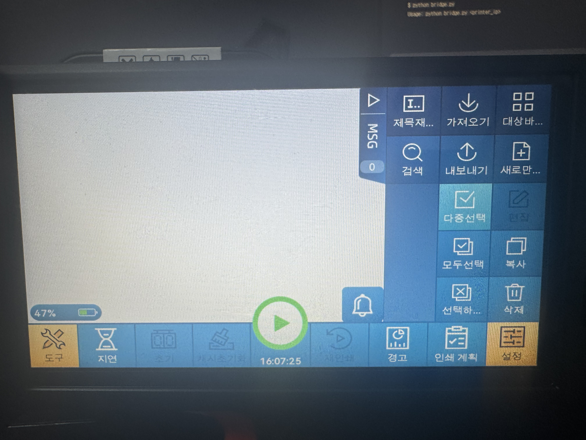
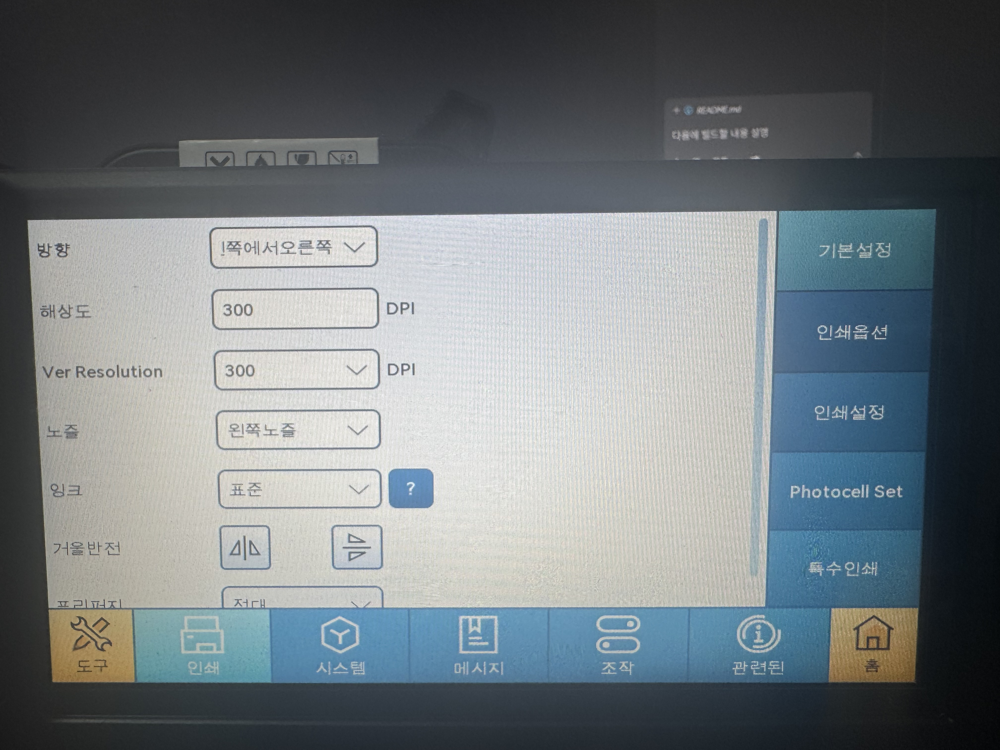
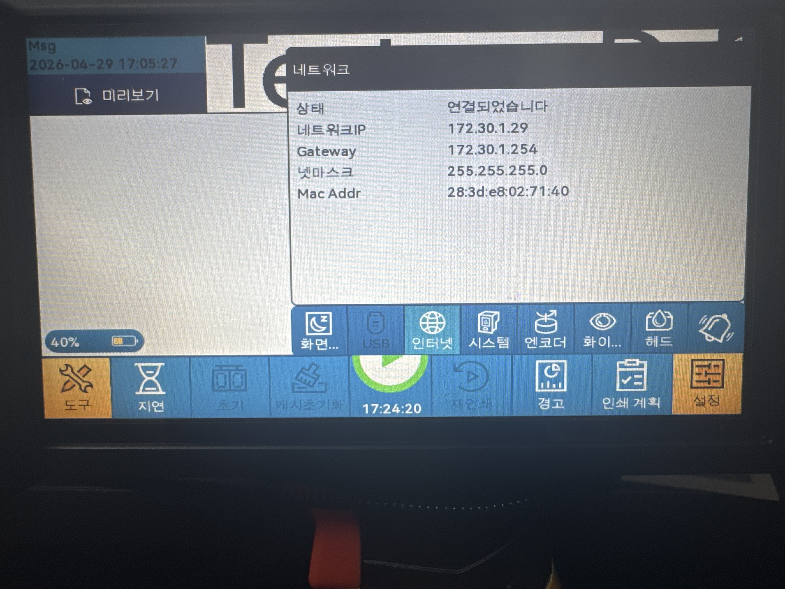
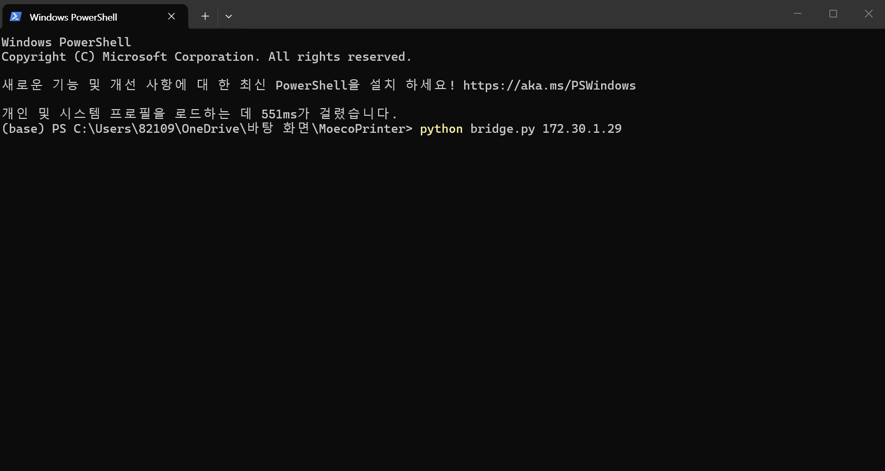
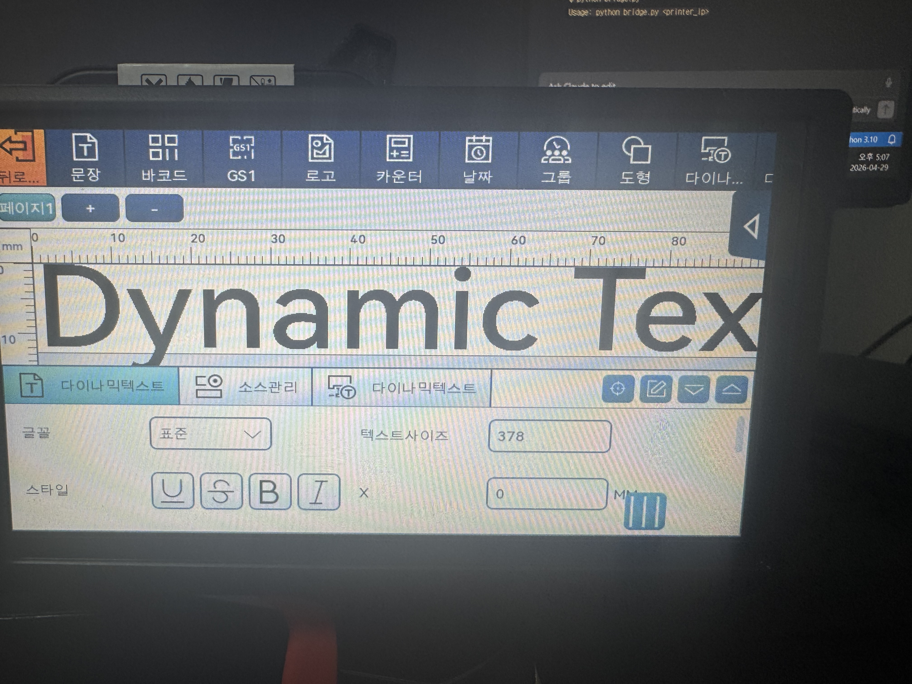
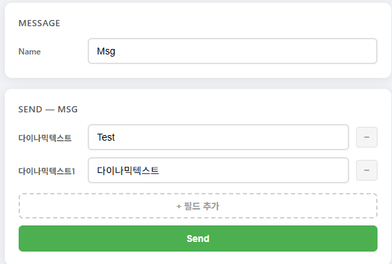
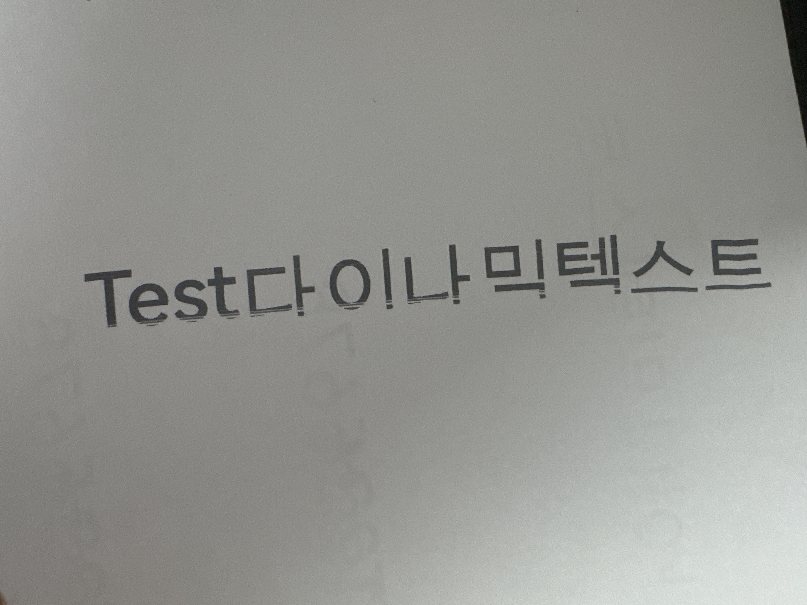
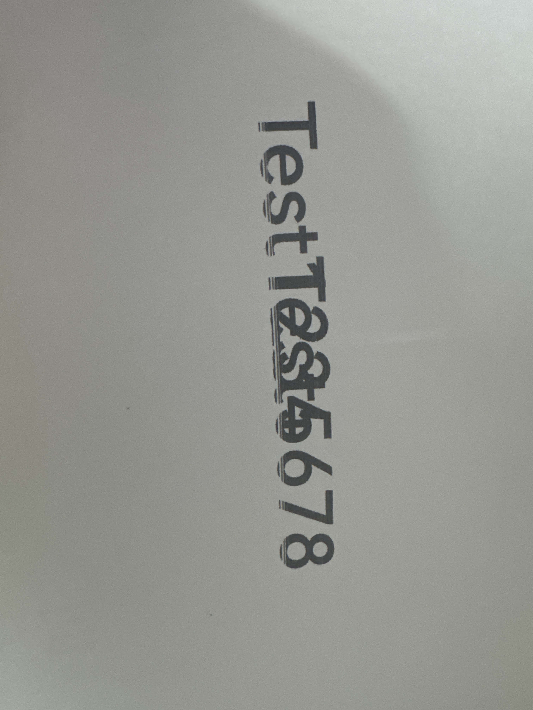

프린터 장비 설정 매뉴얼
MoEco 핸드헬드 잉크젯 프린터의 Wi-Fi 연결 및 다이나믹텍스트 설정 방법입니다.

1단계 : 홈화면 확인

프린터를 켜면 홈화면이 표시됩니다.
좌측 하단의 도구 버튼을 눌러 설정 메뉴로 진입합니다.

2단계 : 홈화면 확장 메뉴

홈화면 우측의 확장 버튼을 클릭하면 추가 메뉴가 나타납니다.
새로 만들기 버튼을 클릭하면 Msg(메시지)를 생성할 수 있습니다.

3단계 : 도구 화면

도구 화면에서 다양한 기능에 접근할 수 있습니다.
좌측 하단의 설정 버튼을 눌러 시스템 설정으로 이동합니다.

4단계 : 설정 화면

설정 화면입니다.
하단의 시스템 탭을 클릭합니다.

5단계 : 시스템 설정

시스템 설정 화면입니다.
우측의 네트워크 항목을 클릭합니다.

6단계 : 네트워크(Wi-Fi) 연결

Wi-Fi 목록에서 사용할 네트워크를 선택하여 연결합니다.
연결이 완료되면 상단에 연결되었습니다 (IP주소) 형태로 표시됩니다.

예시: KT_GiGA_E5D7 연결되었습니다 (172.30.1.29)

7단계 : IP 주소 확인

네트워크 설정에서 네트워크IP 항목의 주소를 확인합니다.
이 IP 주소는 bridge.py 실행 시 인자(argv)로 사용됩니다.
bashpython bridge.py <프린터_IP>
# 예시
python bridge.py 172.30.1.29

IP를 찾지 못한 경우: 홈화면 우측 종 모양(알림) → 인터넷 클릭 시 확인 가능

8단계 : bridge.py 실행

Windows PowerShell을 열고 bridge.py가 있는 경로로 이동한 뒤 실행합니다.
powershellpython bridge.py 172.30.1.29

9단계 : 새로 만들기 - Msg 생성

홈화면 확장 메뉴에서 새로 만들기를 클릭합니다.

상단 좌측 문장 개체 추가 → 고정된 문장 출력 가능
상단 우측 다이나믹텍스트(다이나…) → 외부에서 데이터를 받아 출력하는 동적 텍스트 생성 가능

10단계 : 다이나믹텍스트 추가

다이나믹텍스트를 클릭하면 추가할 수 있습니다.
추가 시 다이나믹텍스트1, 2, 3 ... 형태로 이름이 붙고, 필드 개수가 늘어납니다.

⚠️ 주의: 필드 개수를 맞추지 않고 send할 경우 출력되지 않습니다.

11단계 : 다이나믹텍스트 이동 및 배치

추가된 다이나믹텍스트를 원하는 위치로 이동하여 배치합니다.
레이아웃 상에서 각 텍스트 필드의 위치와 크기를 조정할 수 있습니다.

⚠️ 주의: 두 개의 필드를 사용할 때, 첫 번째 필드의 크기를 넘는 데이터를 전송하면 출력 시 겹쳐 보이는 현상이 발생할 수 있습니다.

12단계 : 다이나믹텍스트 설정

다이나믹텍스트 설정 화면입니다.

프로토콜: Http
서버: 활성화 (토글 ON)
텍스트 분할: 비활성화

13단계 : 다이나믹텍스트 문구 수정

텍스트 내용 필드에 기본값(예: Test)을 입력합니다.
기본값은 외부에서 데이터를 받기 전까지 표시되는 기본 문자열입니다.

14단계 : Send (데이터 전송)

bridge.py 서버가 실행된 상태에서 웹 UI를 통해 데이터를 전송합니다.

다이나믹텍스트 : 첫 번째 필드 값
다이나믹텍스트1 : 두 번째 필드 값

Send 버튼을 클릭하면 프린터로 데이터가 전달되어 출력됩니다.

15단계 : 출력 결과 확인

첫 번째 출력 결과입니다. (Test다이나믹텍스트)

두 번째 출력 결과입니다. (TestTest2345678)

⚠️ 주의사항 요약
항목내용필드 개수 불일치send 시 출력되지 않음필드 크기 초과 데이터두 필드가 겹쳐 출력되는 현상 발생 가능IP 확인 방법네트워크 설정 또는 홈화면 알림 → 인터넷 클릭bridge.py 실행python bridge.py <프린터_IP> 형식으로 실행