# MoEco 핸드헬드 잉크젯 프린터 사용 매뉴얼

이 문서는 MoEco 핸드헬드 잉크젯 프린터의 **기본 텍스트 출력**, **다이나믹텍스트(외부 데이터 연동) 출력**, 그리고 이 저장소에서 만든 **웹 UI(printer_ui.html)를 이용한 원격 제어** 방법을 안내합니다.

## 목차

1. [사전 준비 : Wi-Fi 연결 및 PC 연동](#1-사전-준비--wi-fi-연결-및-pc-연동)
2. [기본 텍스트 출력하기](#2-기본-텍스트-출력하기)
3. [다이나믹텍스트 출력하기](#3-다이나믹텍스트-출력하기)
4. [웹 UI로 프린터 제어하기](#4-웹-ui로-프린터-제어하기)
5. [주의사항 요약 / 문제 해결](#5-주의사항-요약--문제-해결)

---

## 1. 사전 준비 : Wi-Fi 연결 및 PC 연동

웹 UI(4단계)를 사용하려면 프린터와 PC가 **같은 Wi-Fi 네트워크**에 연결되어 있어야 하고, 프린터의 IP 주소를 알아야 합니다. 기본 텍스트만 출력할 경우 이 단계는 건너뛰어도 됩니다.

### 1.1 홈화면 확인


1. 프린터 전원을 켭니다.
2. 홈화면이 표시되면 좌측 하단의 **도구** 버튼을 누릅니다.

### 1.2 도구 → 설정 → 시스템 → 네트워크


1. 도구 화면 좌측 하단의 **설정** 버튼을 클릭합니다.

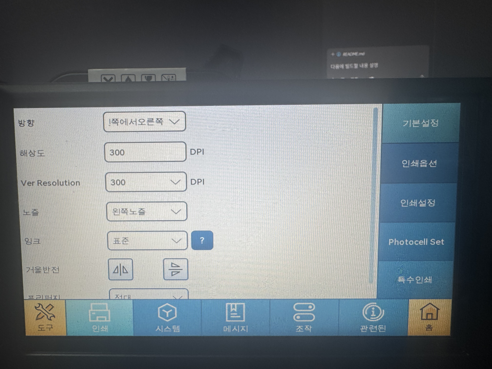

2. 설정 화면 하단의 **시스템** 탭을 클릭합니다.


3. 시스템 설정 화면 우측의 **네트워크** 항목을 클릭합니다.

### 1.3 Wi-Fi 연결


1. Wi-Fi 목록에서 사용할 네트워크를 선택하여 연결합니다.
2. 연결이 완료되면 상단에 **연결되었습니다 (IP주소)** 형태로 표시됩니다.

   > 예시: `KT_GiGA_E5D7 연결되었습니다 (172.30.1.29)`

### 1.4 IP 주소 확인

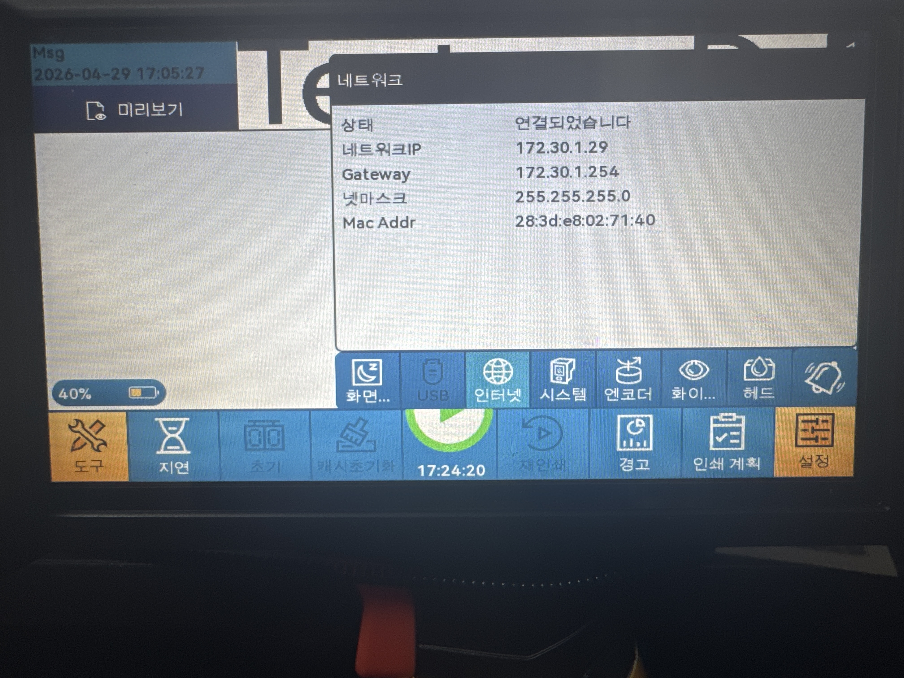

1. 네트워크 설정 화면에서 **네트워크IP** 항목의 주소를 확인합니다.
2. 이 IP 주소는 이후 `bridge.py` 실행 시 인자(argument)로 사용됩니다.

   > IP를 놓친 경우: 홈화면 우측 상단 **종 모양(알림)** → **인터넷** 클릭 시 다시 확인할 수 있습니다.

### 1.5 bridge.py 실행 (PC)

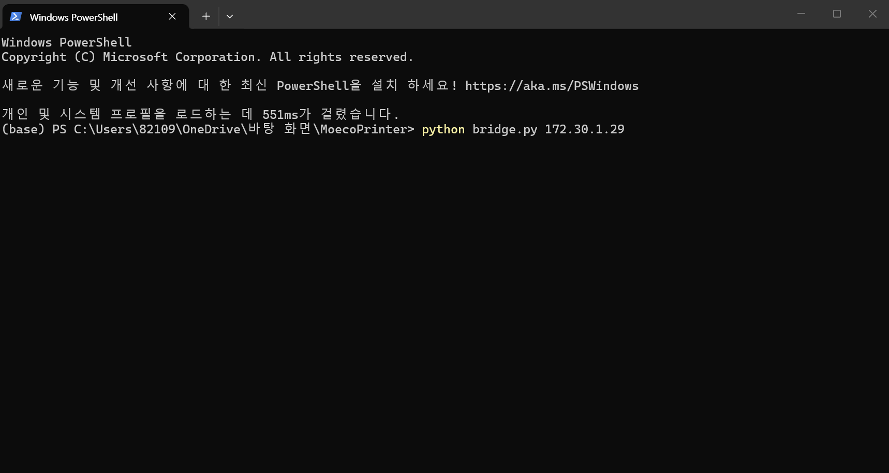

1. PC에서 PowerShell(또는 터미널)을 엽니다.
2. `bridge.py`가 있는 프로젝트 폴더로 이동합니다.
3. 아래 명령어로 실행합니다.

```powershell
python bridge.py <프린터_IP>
# 예시
python bridge.py 172.30.1.29
```

4. 아래와 같은 로그가 출력되면 정상적으로 실행된 것입니다.

```
Proxy running: http://localhost:8765
  /engine/* → http://172.30.1.29:9966
  /data/*   → http://172.30.1.29:9911
```

> ⚠️ IP를 입력하지 않고 실행하면 `Usage: python bridge.py <printer_ip>` 메시지와 함께 종료됩니다.
> ⚠️ `bridge.py`가 실행 중인 동안에만 웹 UI가 프린터와 통신할 수 있습니다. 창을 닫으면 연결이 끊깁니다.

---

## 2. 기본 텍스트 출력하기

프린터 본체에서 직접 고정된 문구(변하지 않는 텍스트)를 만들어 출력하는 방법입니다. 외부 데이터 연동이 필요 없는 라벨/문구 출력에 사용합니다.

### 2.1 새로 만들기 메뉴 진입

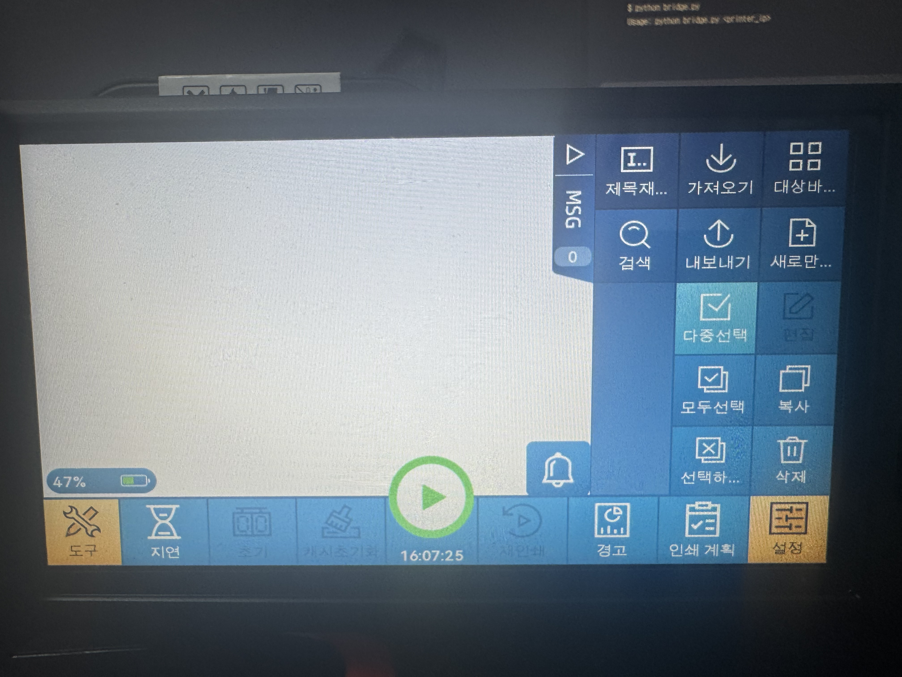

1. 홈화면 우측의 **화살표(확장) 버튼**을 클릭합니다.
2. 펼쳐진 메뉴에서 **New(새로 만들기)** 를 클릭합니다.

### 2.2 Text(문장) 개체 추가

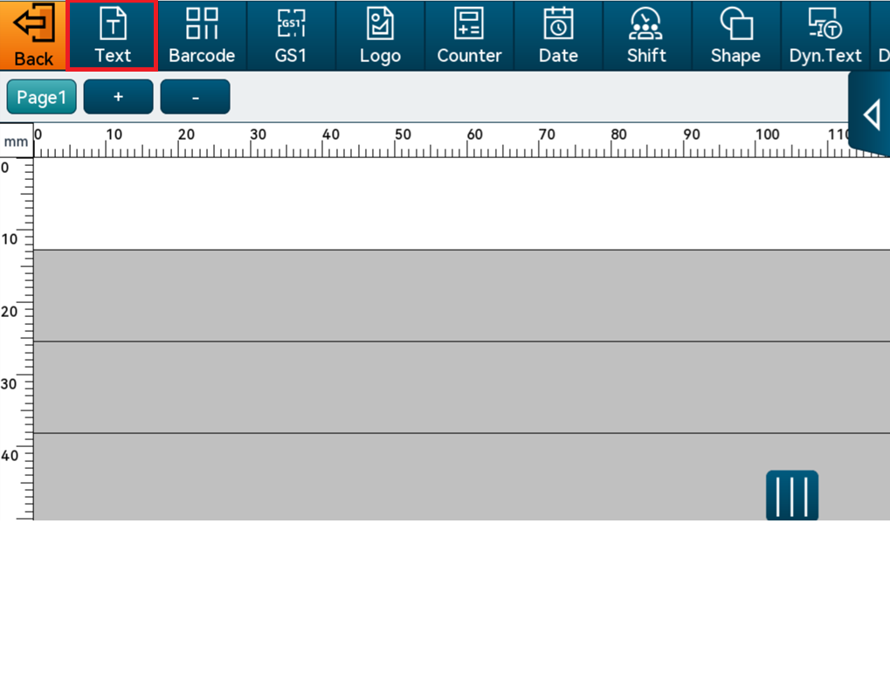

3. 새로 만들기 화면 좌측의 **Text** 아이콘(빨간 박스)을 클릭합니다.

   > 우측의 **Dyn.Text** 아이콘은 외부 데이터를 받아 출력하는 동적 텍스트용입니다. 자세한 내용은 [3. 다이나믹텍스트 출력하기](#3-다이나믹텍스트-출력하기)를 참고하세요.

### 2.3 텍스트 내용 입력

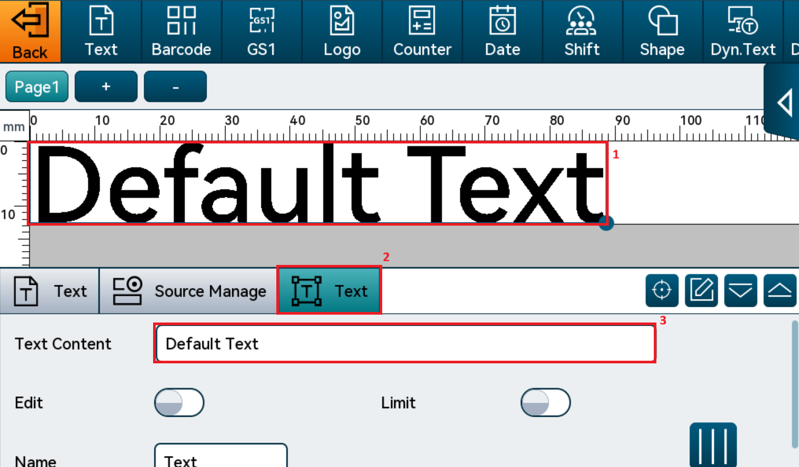

4. 캔버스에 생성된 **① Default Text** 개체를 클릭하여 선택합니다.
5. 하단 속성 패널의 **② Text** 탭이 선택된 상태에서, **③ Text Content(텍스트 내용)** 옆의 입력란을 클릭합니다.
6. 원하는 문구로 텍스트를 수정합니다.

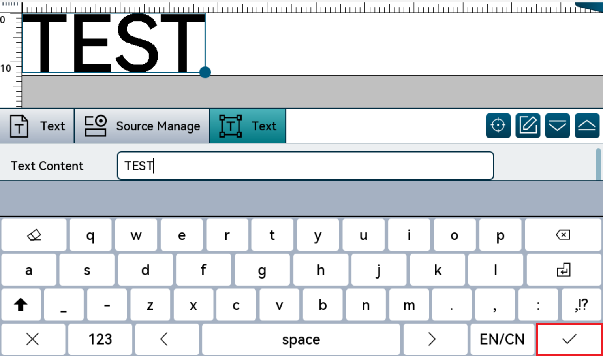

7. 수정이 끝나면 화면 키보드 우측 하단의 **체크(✓) 표시**(빨간 박스)를 눌러 입력을 저장합니다.

### 2.4 이름 지정 및 저장

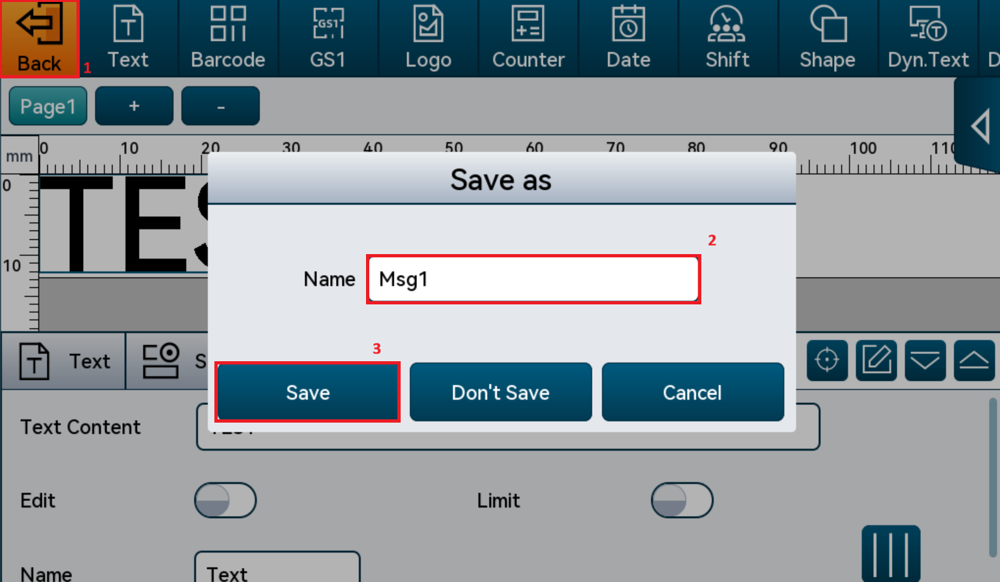

8. **① Back(뒤로가기)** 버튼을 클릭합니다. → **Save as** 팝업이 나타납니다.
9. 팝업의 **② Name** 입력란에 저장할 이름을 지정합니다. (예: `Msg1`)

   > 이 이름이 이후 웹 UI의 **Message** 카드에 입력하는 메시지명이 됩니다. 알아보기 쉬운 이름으로 저장해 두면 좋습니다.

10. **③ Save** 버튼을 클릭해 저장을 완료합니다.

    > `Don't Save`는 저장하지 않고 나가기, `Cancel`은 편집 화면으로 되돌아가기입니다.

11. 저장을 완료하면 홈화면에서 해당 메시지를 불러와 바로 인쇄할 수 있습니다.

---

## 3. 다이나믹텍스트 출력하기

외부(PC/웹)에서 값을 전달받아 매번 다른 내용을 인쇄하고 싶을 때(순번, 날짜, 코드 등) 사용하는 기능입니다.

### 3.1 다이나믹텍스트 개체 추가

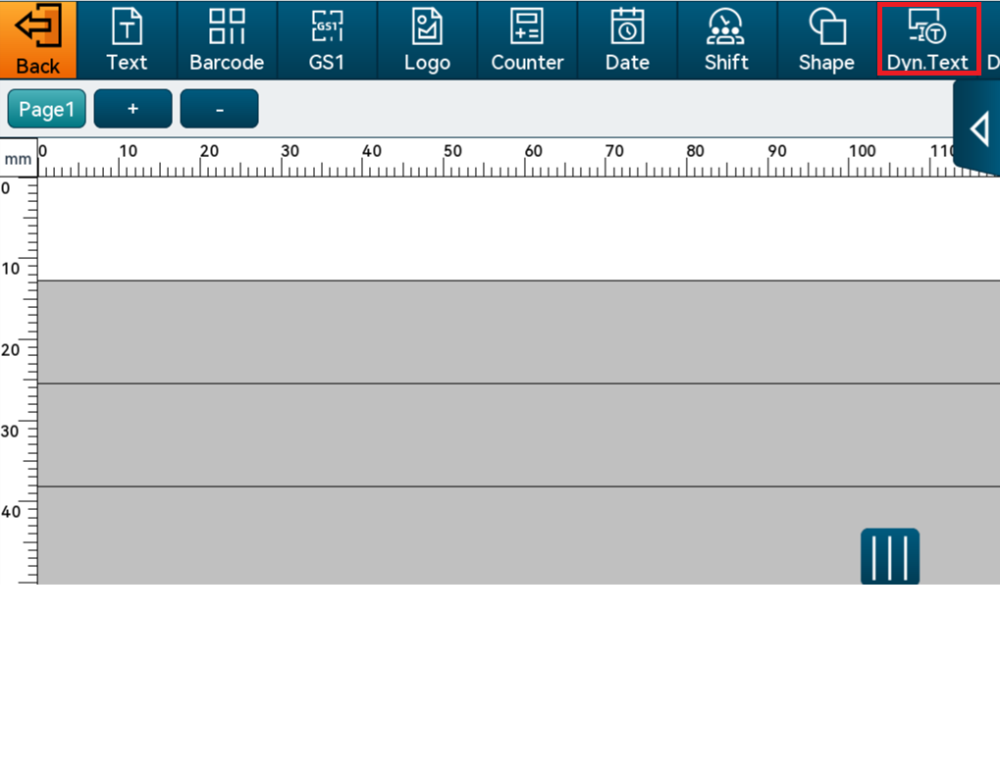

1. [2.1 새로 만들기 메뉴 진입](#21-새로-만들기-메뉴-진입)과 동일하게 홈화면 우측 확장 버튼 → **New(새로 만들기)** 로 진입합니다.
2. 화면 우측의 **Dyn.Text** 아이콘(빨간 박스)을 클릭합니다.


3. 클릭할 때마다 **다이나믹텍스트1, 다이나믹텍스트2, 다이나믹텍스트3 …** 순서로 이름이 붙으며 필드가 하나씩 추가됩니다.

   > ⚠️ **주의:** 프린터에 만들어 둔 필드 개수와 웹 UI(또는 전송 데이터)에서 보내는 값의 개수가 일치해야 합니다. 개수가 맞지 않으면 Send 시 아무것도 출력되지 않습니다.

### 3.2 위치 및 크기 배치


4. 추가된 다이나믹텍스트 개체를 드래그하여 원하는 위치로 이동합니다.
5. 각 필드의 박스 크기를 조절하여 인쇄될 영역을 설정합니다.

   > ⚠️ **주의:** 두 개 이상의 필드를 사용할 때, 실제 전송하는 데이터 길이가 필드 박스 크기보다 크면 다음 필드와 겹쳐서 출력될 수 있습니다. 예상되는 최대 글자 수에 맞춰 여유 있게 크기를 잡으세요.

### 3.3 다이나믹텍스트 세부 설정

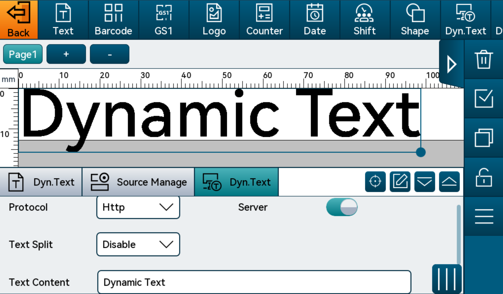

6. 배치한 다이나믹텍스트 개체를 다시 클릭하여 설정 화면으로 들어갑니다.
7. 아래와 같이 설정합니다.

   | 항목 | 값 |
   |------|------|
   | Protocol | Http |
   | Server | 활성화 (토글 **ON**) |
   | Text Split | Disable |

### 3.4 기본값(초기 문구) 설정


8. **Text Content(텍스트 내용)** 필드에 기본값(예: `Test`)을 입력합니다.
9. 이 기본값은 외부에서 실제 데이터를 받기 전까지 화면/인쇄 미리보기에 표시되는 임시 문자열입니다.

### 3.5 이름 지정 및 저장

10. [2.4 이름 지정 및 저장](#24-이름-지정-및-저장)과 동일하게 **Name(이름)** 을 지정하고 저장합니다.
11. 저장된 이름을 이후 `bridge.py` / 웹 UI에서 메시지명으로 사용합니다.

---

## 4. 웹 UI로 프린터 제어하기

이 저장소에서 만든 `printer_ui.html`을 이용하면 PC 브라우저에서 다이나믹텍스트 값을 입력해 프린터로 바로 전송할 수 있습니다. **[1. 사전 준비](#1-사전-준비--wi-fi-연결-및-pc-연동)** 단계(Wi-Fi 연결 + `bridge.py` 실행)가 먼저 완료되어 있어야 합니다.

### 4.1 웹 UI 열기

1. 프로젝트 폴더의 `printer_ui.html` 파일을 더블클릭해 브라우저(Chrome/Edge 권장)로 엽니다.
2. `bridge.py`가 CORS를 처리해주므로 별도의 로컬 서버 없이 `file://` 경로로 열어도 정상 동작합니다.
3. 페이지가 열리면 자동으로 프린터 상태를 1회 조회합니다.

### 4.2 화면 구성 및 사용법

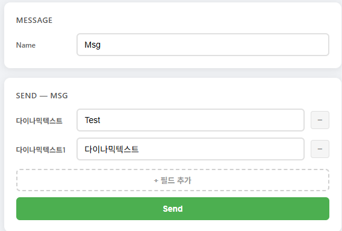

**① Printer Status 카드**
- 프린터 연결 상태(Connected / Disconnected), 엔진 상태(`state` · `message` · `output`), 현재 메시지의 필드 목록을 표시합니다.
- **Refresh** 버튼으로 언제든 상태를 다시 조회할 수 있습니다.

**② Message 카드**
- 프린터에서 만든 메시지 이름(예: `Msg1`, 2단계/3단계에서 저장한 이름)을 입력합니다.
- Refresh 시 프린터에 로드된 메시지명이 자동으로 채워집니다.
- 이전에 입력한 메시지명은 자동완성으로 제안됩니다(최대 20개 저장).

**③ Send 카드**
1. **+ 필드 추가** 버튼으로 다이나믹텍스트 필드 개수만큼 입력창을 만듭니다.
   - 예: 다이나믹텍스트가 2개면 입력창도 2개여야 합니다([3.1 다이나믹텍스트 개체 추가](#31-다이나믹텍스트-개체-추가) 주의사항 참고).
2. 각 입력창의 라벨은 현재 메시지의 필드 순서(`다이나믹텍스트`, `다이나믹텍스트1` …)를 따라 자동으로 표시됩니다.
3. 값을 입력한 뒤 **Send** 버튼을 클릭하면 순서대로 프린터에 전송되어 즉시 인쇄됩니다.
4. 필드가 여러 개일 때 특정 필드를 지우려면 해당 행의 **−** 버튼을 클릭합니다(필드가 1개만 남으면 − 버튼은 숨겨집니다).

**④ Sequence Generator 카드** (순번 인쇄용)
1. **Count**에 생성할 개수를 입력합니다.
2. **두 번째 필드 값**에 모든 버튼에 공통으로 들어갈 값을 입력합니다.
3. **Generate**를 클릭하면 `1 값` · `2 값` · … · `N 값` 형태의 버튼이 만들어집니다.
4. 버튼을 하나씩 클릭할 때마다 해당 값이 2개 필드(순번, 공통값)로 전송되고 버튼은 사라집니다.

**⑤ Button Generator 카드** (특정 값 반복 인쇄용)
1. 값을 입력하고 **Generate**(또는 Enter)를 누르면 그 값이 적힌 버튼이 생성됩니다.
2. 여러 값을 미리 여러 개 만들어두고 순서대로 클릭해 인쇄할 수 있습니다.
3. 클릭 시 첫 번째 필드로 값이 전송되고 버튼은 사라집니다.

**⑥ Log 카드**
- 모든 요청/응답 기록을 타임스탬프와 함께 색상으로 구분해 보여줍니다(파란색: 정보, 초록색: 성공, 빨간색: 오류).
- **Clear** 버튼으로 로그를 초기화할 수 있습니다.

### 4.3 인쇄 결과 확인

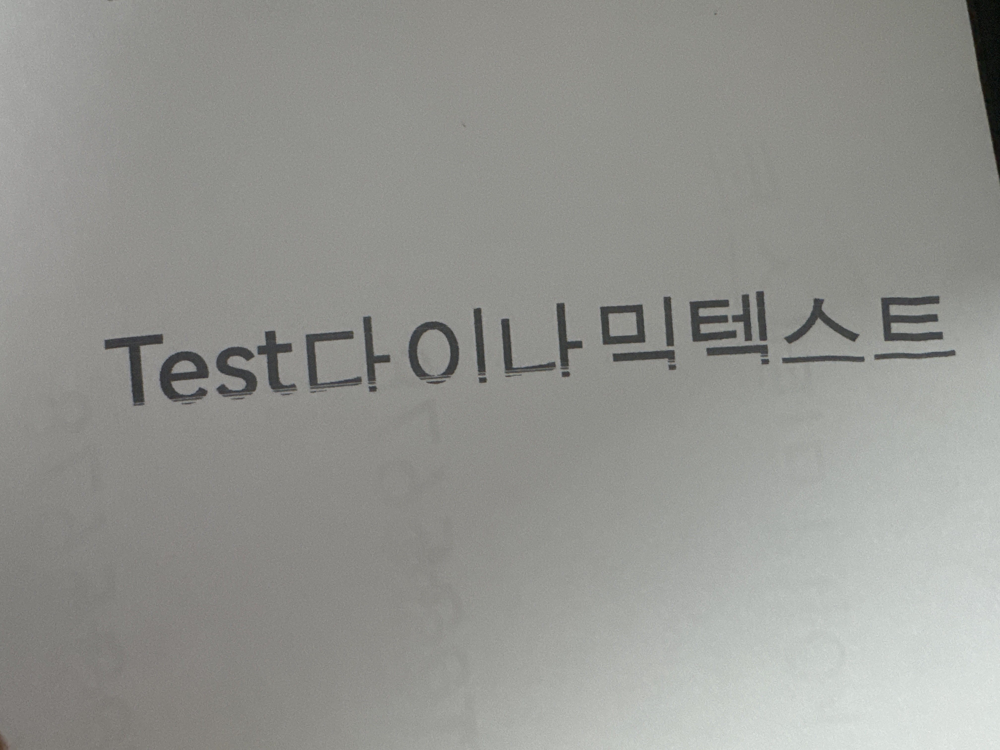 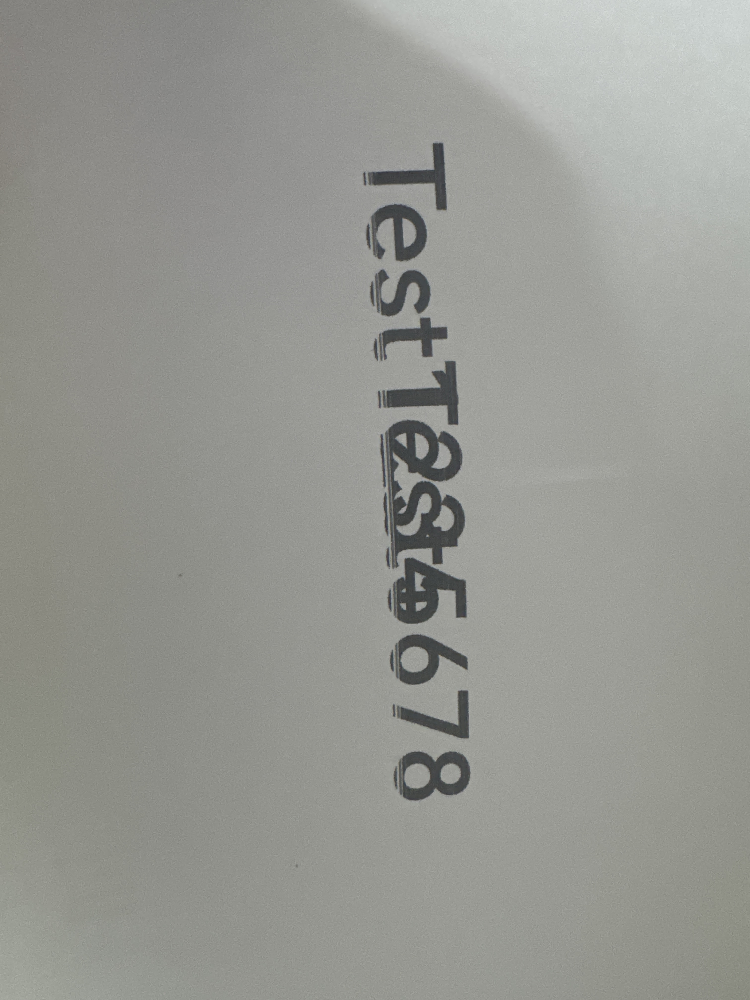

- Send/Generator 버튼 클릭 후 프린터에서 실제 라벨이 출력되는지 확인합니다.
- 왼쪽 예시는 필드 1개(`Test다이나믹텍스트`), 오른쪽 예시는 필드 2개(`TestTest2345678`)를 사용한 출력 결과입니다.
- 두 필드 값이 서로 겹쳐 보인다면 [3.2 위치 및 크기 배치](#32-위치-및-크기-배치)의 필드 크기 설정을 다시 확인하세요.

---

## 5. 주의사항 요약 / 문제 해결

| 증상 / 항목 | 원인 | 해결 방법 |
|---|---|---|
| Send 해도 아무것도 출력되지 않음 | 프린터에 만든 다이나믹텍스트 필드 개수와 전송하는 값 개수가 불일치 | Send 카드의 입력창 개수를 프린터 필드 개수와 동일하게 맞추기 |
| 두 필드가 겹쳐서 출력됨 | 전송한 데이터 길이가 필드 박스 크기보다 큼 | 3.2단계에서 필드 박스 크기를 여유 있게 재조정 |
| 웹 UI에서 Disconnected로 표시됨 | `bridge.py`가 실행 중이지 않거나 프린터 IP가 바뀜 | `bridge.py` 재실행, 1.4단계에서 최신 IP 재확인 후 재실행 |
| IP를 못 찾겠음 | 네트워크 설정 화면을 벗어남 | 홈화면 우측 상단 종 모양(알림) → 인터넷 클릭 |
| `python bridge.py` 실행 시 Usage 메시지 출력 | IP 인자를 입력하지 않음 | `python bridge.py <프린터_IP>` 형식으로 IP를 반드시 포함해 실행 |
| Message 카드에 이름을 입력해도 필드가 안 바뀜 | Refresh를 누르지 않음 | 메시지명 변경 후 **Refresh** 버튼 클릭 |
